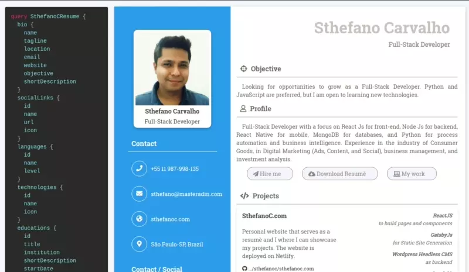

<h1 align="center">GraphQL Resumé with Next.Js, Apollo Server and Nexus Schema</h1>

<p align="center">
  
</p>

Personal GraphQL API to be used to build resumés online.
This is built using **Next.Js** and for the schema, **Nexus Schema**.
It is possible to access all the information using the **GraphQL API**, that comes with its playground as seen on the image below.

The API can be used by anyone on the deployed link:
<a href="https://resume.sthefanoc.com">SthefanoC Resumé Production App</a>

### Preview:

<div style="text-align:center"><a href="https://resume.sthefanoc.com/" target="_blank"></a></div>

### Technologies involved:

GraphQL, NextJS, Nexus Schema, Typescript

<div>
  <code></code>
  <code></code>
  <code></code>
</div>

---

## Step-by-step

### Backend

We will start from the backend, so we know exactly how to power our app.

To start the project, we will use **npx** to bootstrap the initial build of the **NextJS** app, called "graphql-resume":

```
    npx create-next-app graphql-resume
```

Now we have a basic structure of a NextJs application. The first step will be to rename the _hello.js_ to _graphql.ts_.

Next step will be adding our dependencies:

```
    yarn add @nexus/schema apollo-server-micro date-fns graphql graphql-scalars micro
```

Here is the reason why we are using each one of those:

- **@nexus/schema**: to build the schema and resolvers all in one
- **apollo-server-micro**: normally it would be just an Apollo Server, but since it is inside a NextJS application, we use the micro version
- **date-fns**: to calculate difference between dates (related to the jobs)
- **graphql**: required by Apollo Server
- **graphql-scalars**: to define custom scalars types
- **micro**: needed to integrate Apollo Server to the app

After installing those, we add two more dependencies for TypeScript:

```
    yarn add --dev @types/react typescript
```

After that, we can start the application:

```
    yarn dev
```

By default, the NextJS application boiler plate will start on the port 3000 ([http://localhost:3000/](http://localhost:3000/)).

Since we will start from the backend, we will not do much of this part right now.

Inside the `graphql.ts` file (pages > api > graphql.ts), we will start by deleting everything and starting the ApolloServer, the micro version. To start, we will follow the steps:

1. Import ApolloServer form _apollo-server-micro_
2. Create the server
3. Create a handler
4. Export the handler

In the end, the file will look like this:

```javascript
import { ApolloServer } from 'apollo-server-micro';

const server = new ApolloServer({});
const handler = server.createHandler({ path: '/api/graphql' });

export default handler;
```

Now, for the graphql api endpoint to work, we will neeed to add some types, since Apollo Server requires either an existing schema, modules or typeDefs.

Using [Apollo Docs](https://www.apollographql.com/docs/apollo-server/getting-started/) as reference, we can create types and resolvers.
The steps to be followed are:

1. Import "schema" (a file that doesn't exist yet) from "src/schema"
2. Create the schema.ts file in the folder
3. Pass "schema" as an argument to the server
4. Add a "baseUrl" property to the tsconfig file, so we can import things directly from the "." and not have to create long paths on imports

The api file will have these lines now:

```javascript
import { schema } from 'src/schema';

const server = new ApolloServer({ schema });
```

Now, on the `schema.ts` file, we will:

1. Import "makeSchema" from "@nexus/schema"
2. Export const schema using the method imported
3. Pass types
4. Import \* as types from "./allTypes" (that doesn't exist yet, but we will create a folder and a index.ts file to follow)

Now the file will look like this:

```javascript
import { makeSchema } from '@nexus/schema';
import * as types from './allTypes';

export const schema = makeSchema({
  types,
});
```

The next step will be creating the files inside the "allTypes" folder, starting by the `Query.ts`. Query is kind of the top level data type, the root type, sometimes. For this file we will import the "queryType" and export this information.
The file will look like this:

```javascript
import { queryType } from '@nexus/schema';

export const Query = queryType({
  definition(t) {
    t.string('name', () => 'Sthefano');
  },
});
```

And finally, inside the `index.ts` file we will import and export the Query. The file will look like this:

```javascript
export * from './Query';
```

Now, back at the `graphql.ts` file, we will need to add an export to a config that toggles "bodyParser" as false, so it loads our requests. That part looks like this:

```javascript
export const config = {
  api: {
    bodyParser: false,
  },
};
```

After that, the API is working!
Now it's the time to add data to it :)

This data will be added to a file named `data.ts`, which is basically going to have all the information provided by our API.
The complete file can be seen here, [inside this repo]("src/data.ts"). The structure is something like this:

```javascript
export const data = {
  bio: {
    name: 'Sthefano Carvalho',
    tagline: 'Full Stack Developer',
    email: 'sthefano@masteradin.com',
    github: 'https://github.com/sthefanoc',
    website: 'https://www.sthefanoc.com',
    linkedin: 'https://linkedin.com/in/sthefanocarvalho',
    objective: 'Build amazing tools with the best technologies.',
  },
  skills: ['Python', 'Javascript', 'HTML', 'CSS', 'ReactJS', 'NodeJS'],
  positions: [
    {
      id: '1',
      title: 'Full Stack Developer',
      company: 'SthefanoC.com',
      startDate: '2020-01-01',
      endDate: null,
      employmentType: 'PART_TIME',
      location: 'São Paulo, Brazil',
      achievements: [
        'Automation Tools Development using Python, deploying scripts on Heroku, Google Cloud Platform and Python Anywhere',
        'Website development using HTML, CSS and Javascript, deploying on Github Pages, Netlify and cPanel hosting platforms',
        'Frontend Development using ReactJs, GatsbyJS and NextJS for interface, Redux for state management',
        'Backend Development using NodeJs, Express, Django, Flask and Firebase',
        'Mobile Development using Hybrid App Development technologies, such as React Native and PWA',
      ],
    },
    {
      id: '2',
      title: 'Managing Director | Co-founder',
      company: 'Masteradin',
      startDate: '2018-11-01',
      endDate: null,
      employmentType: 'FULL_TIME',
      location: 'São Paulo, Brazil',
      achievements: [
        'Process Automation using Selenium',
        'E-commerce website performance evaluation: technical and strategic'
        'Business Analysis using Growth Hacking Techniques',
        'SEM (Google Ads), SEO (Content and Tech), Backlink Acquisition, Social Media (WhatsApp & Instagram)',
      ],
    },
    {
      id: '3',
      title: 'Customer Development Analyst',
      company: 'Unilever',
      startDate: '2015-01-01',
      endDate: '2018-09-01',
      employmentType: 'FULL_TIME',
      location: 'São Paulo, Brazil',
      achievements: [
        'Website implementation',
        'Contract Management',
        'Investment Analysis',
        'Financial Management',
        'Training and Team Leadership'
      ],
    },
    {
      id: '4',
      title: 'Customer Development Analyst',
      company: 'Unilever',
      startDate: '2014-02-01',
      endDate: '2015-02-01',
      employmentType: 'FULL_TIME',
      location: 'São Paulo, Brazil',
      achievements: [
        'Performance KPI\'s',
        'Financial Management',
        'Strategy and relationship with Distributors',
        'Innovation Planning'
      ],
    },
    {
      id: '5',
      title: 'Marketing Intern',
      company: 'Unilever',
      startDate: '2012-01-01',
      endDate: '2013-12-01',
      employmentType: 'FULL_TIME',
      location: 'São Paulo, Brazil',
      achievements: [
        'Responsible for organizing events and store promotional campaigns and programs.',
        'Responsible for the development and implementation of Visibility Materials.',
      ],
    },
  ],
};
```

The next step will be to add the fields to the `Query.ts` file.
We will add two important information: the type of the data and how this data is loaded, how it is resolved.
For the type, we will mark the **type** as "Bio", which is not created yet, but we wil get to it, and for the way the data will be loaded, the **resolve** we will add an arrow asynchronous (optionally) function.
The resolver may receive 3 arguments.
The parent is one of them. For the base query, the parent will be _root_.
The next will be "args".
And finally, the context ("ctx"). That's where we have the connection to the databases, authentication restrictions and such.

Since we don't need all of that in this part, we will just add a simple arrow function, that will bring the data from the `data.ts` file.
After importing "Bio" from the "index", it will be something like this:

```javascript
import { queryType } from '@nexus/schema';
import { data } from 'src/data';
import { Bio } from './index';

export const Query = queryType({
  definition(t) {
    t.field('bio', {
      type: Bio,
      resolve: () => data.bio,
    });
  },
});
```

Inside the allTypes folder, we create the `Bio.ts` file.
Now we can declare the types!
To do that, we will import the "objectType" form "@nexus/schema" and define all of the different fields this data has.

Since we are just accessing a property, there's no need to declare a resolver.

Inside the `Bio.ts` we will have:

```javascript
import { objectType } from '@nexus/schema';

export const Bio = objectType({
  name: 'Bio',
  definition(t) {
    t.string('name');
    t.string('tagline');
    t.string('email');
    t.string('objective');
    t.url('github', (bio) => new URL(bio.github));
    t.url('website', (bio) => new URL(bio.website));
    t.url('linkedin', (bio) => new URL(bio.linkedin));
  },
});
```

And that will be exported by adding "export \* from "./Bio" to the `index.ts` file inside the allTypes folder:

```javascript
export * from './Query';
export * from './Bio';
```

The query should be working now.
In the link http://localhost:3000/api/graphql, there should be possible to query the name, for example, inside the query.

For the URLs, we have to create a new URL element. This is a new type that we have to add.

To do that, we will import "decorateType" and "GraphQLURL" inside the `index.ts` file from the "allTypes" folder. Another type we will have to create is "GraphQLDate", so this will also be imported.

After that, we will define the scalars, determining which types are going to be decorated with those scalars.
This is the result inside the `index.ts` file, from the "allTypes" folder:

```javascript
import { decorateType } from '@nexus/schema';
import { GraphQLDate, GraphQLURL } from 'graphql-scalars';

export const GQLDate = decorateType(GraphQLDate, {
  rootTyping: 'Date',
  asNexusMethod: 'date',
});

export const GQLURL = decorateType(GraphQLURL, {
  rootTyping: 'URL',
  asNexusMethod: 'url',
});
```

Now we will have to give Nexus a little more information about the types we are working with.

The first step will be to create a folder named "generated" where we will generate all the types that nexus will be using.

On the `schema.ts` file, we will set an output, where there will be a schema.
This **schema** will use "path.join" (that we will have to import). This schema will receive the path of the "schema.graphql" file, that Apollo wants us to type by hand, but if there is a way to automate it, it's better.
The other part part of the output will be **typegen**, that will receive a similar argument of path, but to get the "nexus.ts" file inside the "generated" folder.

When this runs, the file will be created automatically, bringing of the typeScript type definitions.

The final file will be:

```javascript
import { makeSchema } from '@nexus/schema';
import path from 'path';
import * as types from './allTypes';

export const schema = makeSchema({
  types,
  outputs: {
    schema: path.join(process.cwd(), 'schema.graphql'),
    typegen: path.join(process.cwd(), 'src', 'generated', 'nexus.ts'),
  },
});
```

To fix the problem of the links not being recognized, we will create a file called `interfaces.ts` inside the "src" folder, where we will declare som types for the BioInterface.
We can also add this information about the PositionInterface.
The file will be like this:

```javascript
export interface BioInterface {
  name: string;
  tagline: string;
  email: string;
  github: string;
  website: string;
  linkedin: string;
  objective: string;
}

export interface PositionInterface {
  id: string;
  title: string;
  company: string;
  startDate: string;
  endDate?: string;
  location: string;
  achievements: string[];
}
```

Even though we declare the websites as strings, this is still correct because they started as strings and were converted to URLs later.

For the "id", we might have to declare as an integer, depending on the source.
The field "endDate" will be set as a conditional, because it may or may not exist.
Finally, for the achievements, the type will be set as an array of strings.

With the interfaces defined, we have to tell Nexus where to find this information and knows that it is working with.
We can do that by going back to the `schema.ts` file and adding **typegenAutoConfig** to the schema. Here, we declare possible sources from where to load the type information from.
Here we could import information from "prisma", if working with a database, or, in our case, locally.
Inside those sources, we declare an "alias", the exact "source" to the type file and a "typeMatch", where we declare exactly how the types will be interpreted. In our case, it will be a regex with the word "Interface".

Another useful thing we can add is the **backingTypeMap**, that basically sets some default types for some common cases.
This can be hard to debug, but can be really useful sometimes. In our case, we can use "date" and "url" as default properties.

To avoid some issues, we can add, at last, a **debug** property, that will create outputs only on development environment.

This setup might look too much, but we only have to set this once, and after that, we will have a "type safe" application.

The file will be like this in the end:

```javascript
import { makeSchema } from '@nexus/schema';
import path from 'path';
import * as types from './allTypes';

export const schema = makeSchema({
  types,
  outputs: {
    schema: path.join(process.cwd(), 'schema.graphql'),
    typegen: path.join(process.cwd(), 'src', 'generated', 'nexus.ts'),
  },
  typegenAutoConfig: {
    sources: [
      {
        alias: 'faces',
        source: path.join(process.cwd(), 'src', 'interfaces.ts'),
        typeMatch: (type) => new RegExp(`(${type}Interface)`),
      },
    ],
    backingTypeMap: {
      Date: 'Date',
      URL: 'URL',
    },
    debug: process.env.NODE_ENV === 'development',
  },
});
```

Now, for the positions part, we will add a file named `Positions.ts` inside the "allTypes" folder and fill it up similarly to the "Bio.ts" file.
The most notable difference is with dates. That part will need resolving, since the original information is a string, so it has to be converted to a date.
For the endDate, we will have to add a ternary operator to check if the information exists, since it is a nullable field.

Another important date related field is about the time in a position. For that, we will add a function that deals with this calculation.

The file will look like this:

```javascript
import { objectType } from '@nexus/schema';
import { differenceInYears, differenceInMonths } from 'date-fns';

export const Position = objectType({
  name: 'Position',
  definition(t) {
    t.id('id');
    t.string('title');
    t.string('company');
    t.string('location');
    t.date('startDate', {
      description: 'When I started at this position',
      resolve: (position) => new Date(position.startDate),
    });
    t.date('endDate', {
      nullable: true,
      resolve: (position) =>
        position.endDate ? new Date(position.endDate) : null,
    });
    t.int('years', ({ endDate, startDate }) =>
      differenceInYears(
        endDate ? new Date(endDate) : new Date(),
        new Date(startDate)
      )
    );
    t.int(
      'months',
      ({ endDate, startDate }) =>
        differenceInMonths(
          endDate ? new Date(endDate) : new Date(),
          new Date(startDate)
        ) % 12
    );
    t.list.string('achievements', (position) => position.achievements);
  },
});
```

However, we still cannot use these fields for two reasons.

The first is because we need to export "Position" on the `index.ts` file inside the "allTypes" folder.
So:

```javascript
export * from './Position';
```

And the second is because we didn't give a way for the query to find the positions. That information will be added to the `Query.ts` file, on which we will import the positions and declare its types and its resolves.

```javascript
import { queryType, idArg } from '@nexus/schema';
import { data } from 'src/data';
import { Bio, Position } from './index';

export const Query = queryType({
  definition(t) {
    t.field('bio', {
      type: Bio,
      resolve: () => data.bio,
    });

    t.list.field('positions', {
      type: Position,
      resolve: () => data.positions,
    });
  },
});
```

Another way we can use this part is giving arguments to the field. So, if we wanted to find a position using ID, we could do something like this:

```javascript
t.field('position', {
  type: Position,
  description: 'Find a position by its ID',
  nullable: true,
  args: { id: idArg() },
  resolve: (root, { id }: { id: string }, ctx) =>
    data.positions.find((position) => position.id === id),
});
```

To use this, we will need to import **idArg**:

```javascript
import { queryType, idArg } from '@nexus/schema';
```

And with that we finish the backend of out application.
On the GraphQL Playground it is possible to test the different results and to see information about the different variables, with the descriptions set for different types, inside the "allTypes" folder.

### Frontend

For the front-end, it really depends on what kind of template you will use. I have used a template from [Smart Eye website](https://www.smarteyeapps.com/free-personal-website-resume-website-profile-website) and adapted it to my data.

The general steps to be followed are:

- ON the `index.js` -> convert it to `tsx` and cleanup, besides adding relevant data to the "Head" tag, like favicon, language, and title.
- On the `pages\_app.js` -> convert it to `tsx`. This will the wrapper around the whole application. This is where we import what we want to have access on every single page. We will wrap the whole and on a **ApolloProvider** and create hook, **useApollo()** to initialize our provider.
- Create a `src/apolloClient.ts`: **ApolloClient** hook. InMemoryCache. ApolloClient, HttpLink, NormalizedCacheObject. Next examples. New function createApolloClient. Run if not apolloClient.
- On the `index.tsx`: import **useQuery** and gql from '@apollo/client". Create const with {data, error, loading}. Manage error.
- On `index.tsx`: start CV layout. Formatting the different parts of data. Website link, github page, experience, date formats(create variable to deal with the years and months). Map different items of education and projects. And finally, use Syntax highlighter to make the graphql schema beautiful. Change style. Print from graphql/printer.


## Deployment

## Built with

- [Visual Studio Code](https://code.visualstudio.com/) - for editing
- [Vercel](https://vercel.com/) - for deployment
- [Hostinger](https://www.hostinger.com.br/) - for managing domains
- [ReactJs](https://reactjs.org/) - for building components and logic
- [NextJs](https://nextjs.org/) - for dynamic SSG
- [Apollo Server](https://www.apollographql.com/docs/apollo-server/) - for self-documenting GraphQL API
- [Apollo Client](https://www.apollographql.com/docs/react/) - for state management
- [GraphQL](https://graphql.org/) - to query data
- [Date-Fns](https://date-fns.org/) - to deal with formatting dates
- [React Syntax Highlighter](https://github.com/react-syntax-highlighter/react-syntax-highlighter) - for bringing the correct formats for the front-end

## Authors

- **Sthefano Carvalho** - [SthefanoC](https://github.com/sthefanoc)

## Acknowledgments

This project was inspired by a 2 video tutorial from [Leigh Halliday](https://github.com/leighhalliday/).

The videos:

- [Backend](https://youtu.be/_HOp7hBEjp8)
- [Frontend](https://youtu.be/ZFTRyuLwqdQ)

The original source code:

- [Github Repo](https://github.com/leighhalliday/graphql-resume)

The front-end part is built on a CV template found on SmartEye website:

- [Free Personal, Profile, Resume HTML Website Template](https://www.smarteyeapps.com/free-personal-website-resume-website-profile-website)
